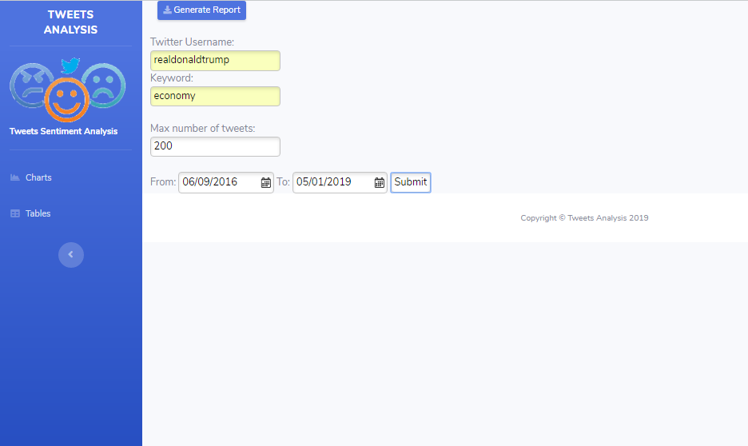
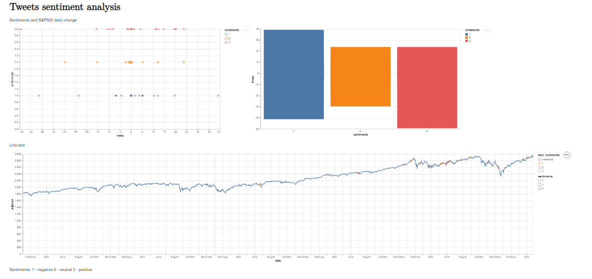

# Tweets Analysis

A Clojure Project designed to help in data science analysis of Tweets and Financial market indexes.

Sentiment analysis library is provided by https://github.com/damionjunk/damionjunk.nlp that uses Stanford's CoreNLP.

Loading tweets older than 7 days is possible thanks to the https://github.com/Jefferson-Henrique/GetOldTweets-java library.

Charts and visualizations made possible thanks to https://github.com/metasoarous/oz.

## Usage

In order to use this application, you have to:
<ul>
1. Have Leiningen installed (for Windows users: http://leiningen-win-installer.djpowell.net/)</ul>
<ul>2. Have mongoDB installed https://www.mongodb.com/download-center/community </ul>
<ul>3. Download the desired index/historical value datasheet from https://finance.yahoo.com as CSV. For the example bellow, use https://finance.yahoo.com/quote/%5EGSPC?p=^GSPC .
Edit the CSV file: date format needs to be in MM/dd/yyyy. Change all column names to be lowercase (date instead of Date, adjclose instead of Adjusted close etc.). 
Upload the CSV file to mongoDB and create data base SP (in the given example we evaluate Standard&Poor 500 index), and data collection Spider (S&P500 indexed ETFs nickname on WallStreet). In order to use other indexes, make sure you change the database and data collection name in .core namespace - <b>get-index</b> and <b>data-dates-adjclose</b> functions. </ul>

Start the application by navigating to the project folder in the console and type <b>lein run [port number]</b> (for example 7800).

You can now find the application on your browser by typing localhost:[port number].

The home page will look like this:

When you fill out the search form, press Submit.

You will get the tweets for the dates you entered, the tweet text and how the index (in this case S&P500) changed for that day.

The second tab will provide you with charts: Histogram, Line plot, and Scattered plot (made possible by Oz library).

Histogram and Colored Scatterplot are showing how many times did the index change up or down regarding the sentiment of the tweet.
The sentiment analysis in the application marks the tweet text as positive, neutral or negative (1, 2 o 3 respectively).
Finally, the line plot provides you with the index timeseries together with sentiment marks (1, 2 or 3) added on dates tweets were posted. Here you can track if the index changed and what was the tweet and its sentiment that day.

Next step of this application will be adding an option to generate the PDF report on the analysis that the user gets and to add multiple indexes for the analysis to be more precise (charts, tables and create report buttons). Stay tuned :)

## References:
<ul>
<li>[stylefy "1.12.0"]</li>
<li>[metasoarous/oz "1.6.0-alpha2"]</li>
<li>[enlive "1.1.6"]</li>
<li>[markdown-to-hiccup "0.6.2"]</li>
<li>[me.jhenrique/getoldtweets "1.1.0"]</li>
<li>[damionjunk/nlp "0.3.0"]</li>
<li>[com.novemberain/monger "3.1.0"]</li>
<li>[clj-time "0.15.0"]</li>
<li>[cheshire "5.8.1"]</li>
<li>[ring "1.7.1"]</li>
<li>[compojure "1.6.1"]</li>
<li>[hiccup "2.0.0-alpha2"]</li>
<li>[selmer "1.12.6"]</li>
</ul>
  

## License

Copyright © 2019 

Distributed under the Eclipse Public License either version 1.0 or (at
your option) any later version.
